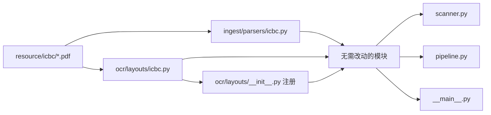

# PayCheck 模块化重构设计

> 日期: 2026-06-01
> 状态: 已实施

## 1. 动机

当前代码采用扁平结构，所有模块平铺在 `src/paycheck/` 下，存在以下问题：

- **混合职责**：`parsers.py` (397 行) 同时包含 Transaction 模型、CSV 工具函数、三个平台的解析逻辑
- **入口过重**：`__main__.py` 把 CLI 解析、自动 OCR 编排、解析调度、流程控制全部混在一起
- **分析层混乱**：`analyzer.py` 中的内部转账检测逻辑与聚合统计混在一个文件里
- **可扩展性差**：OCR 子系统的列坐标写死在 `ocr_common.py` 中，新增银行格式需要修改核心代码
- **模块边界不清晰**：没有层级依赖约束，任何模块可以引入任何其他模块

## 2. 设计目标

- **分层清晰**：代码按职责分为 core / ingest / ocr / analysis / report 五层，依赖单向
- **可扩展**：新增银行只需添加 layout 文件和解析器文件，不修改现有代码
- **内聚性强**：每个模块有明确的职责边界
- **入口瘦身**：`__main__.py` 只做 CLI 编排，不包含业务逻辑

## 3. 架构总览

```
resource/                           ← 输入目录（目录名 = layout 匹配 key）
├── wechat/*.xlsx
├── ant/*.csv
└── boc/*.pdf / *.csv              ← 原 bank/，已改名

src/paycheck/
├── __init__.py
├── __main__.py                     ← CLI 入口（仅编排，无业务逻辑）
│
├── core/                           ← 领域模型（零依赖）
│   └── models.py                   ← Transaction 统一数据模型
│
├── ingest/                         ← 数据导入
│   ├── scanner.py                  ← 递归扫描，子目录名自动匹配 layout
│   ├── csv_utils.py                ← CSV 行解析工具（引号字段处理）
│   └── parsers/
│       ├── wechat.py               ← resource/wechat/*.xlsx → Transaction
│       ├── alipay.py               ← resource/ant/*.csv → Transaction
│       └── boc.py                  ← resource/boc/*.csv → Transaction
│
├── ocr/                            ← OCR 子系统（可扩展）
│   ├── engine.py                   ← PaddleOCR 封装（银行无关）
│   ├── pdf_render.py               ← PDF→图片 + 表格检测（银行无关）
│   ├── pipeline.py                 ← 管线编排（根据 layout 名调度）
│   └── layouts/
│       ├── base.py                 ← BankLayout 接口 + 工具函数
│       └── boc.py                  ← BocLayout：列坐标 + 行分组 + 转 Transaction
│
├── analysis/                       ← 业务分析
│   ├── filters.py                  ← 内部转账检测规则
│   └── stats.py                    ← 聚合统计
│
└── report/                         ← 输出
    └── html_reporter.py            ← HTML + ECharts 报表
```

## 4. 分层依赖（严格单向）

```
__main__ → ingest.scanner
         → ingest.parsers.{wechat, alipay, boc}
         → ocr.pipeline → ocr.layouts.{base, boc}
         → analysis.{filters, stats} → core.models
         → report.html_reporter

core.models         → 零依赖
ingest.csv_utils    → 零依赖
ocr.layouts.base    → PIL（find_table_bounds 用到的像素操作）
ocr.pdf_render      → fitz, PIL
```

禁止反向依赖：core 不引用任何其他层，ingest/ocr 不引用 analysis/report。

## 5. 模块详解

### 5.1 core/models.py

```python
@dataclass
class Transaction:
    platform: str          # "wechat" | "alipay" | "bank"
    time: str              # "2025-01-03 12:30:00"
    category: str
    counterparty: str
    description: str
    amount: float
    tx_type: str           # "支出" | "收入" | "不计收支"
    payment_method: str
```

全局唯一领域模型，所有层都依赖这个模型。

### 5.2 ingest/ 数据导入

**scanner.py** — 递归扫描输入目录，按子目录名匹配对应的 parser 和 layout key：

| 子目录 | 匹配 parser | layout key |
|---|---|---|
| `wechat/` | `parsers/wechat.py` | - |
| `ant/` | `parsers/alipay.py` | - |
| `boc/` | `parsers/boc.py` | `"boc"` |

**parsers/ 拆分** — 每个平台一个独立文件，新增平台只需加文件，不改现有解析器。

**csv_utils.py** — `parse_csv_line()` 等工具函数，被 alipay / boc 解析器共用。

### 5.3 ocr/ OCR 子系统

**ocr/layouts/base.py** — 银行无关的共用品：

| 组件 | 用途 |
|---|---|
| `BankLayout` 抽象类 | 接口契约：`columns`、`group_rows`、`to_transactions` |
| `find_table_bounds()` | 亮度检测表格区域（默认实现，各银行可覆盖） |

> 不做 OCR 字符级后处理清洗，完全依赖 OCR 识别结果的正确性。

**ocr/layouts/boc.py** — BOC 特定实现：

```python
class BocLayout(BankLayout):
    name = "boc"
    columns = [("date", 0, 202), ("time", 202, 380), ...]
    group_rows(items, scale)        # date 列 Y 轴锚点分组
    to_transactions(rows) → list[Transaction]
```

**layout 注册与匹配** — `layouts/__init__.py` 维护注册表：

```python
_registry: dict[str, type[BankLayout]] = {}

def register(layout: type[BankLayout]): ...
def get_layout(name: str) -> BankLayout: ...
```

pipeline.py 按 `layout_name` 参数获取对应 layout 实例处理 PDF。

### 5.4 analysis/ 业务分析

**filters.py** — 内部转账检测规则（易变）：

| 平台 | 判定规则 |
|---|---|
| 支付宝 | `tx_type == "不计收支"` |
| 微信 | category 含"充值"/"提现"/"零钱" |

**stats.py** — 聚合统计（稳定）：计算总支出/总收入/月均/月度趋势/类别分布/平台对比。

### 5.5 report/ 输出

**html_reporter.py** — 接收 stats 输出的数据结构，生成自包含 HTML（ECharts 图表）。

## 6. 文件映射

| 当前文件 | 新位置 | 变更类型 |
|---|---|---|
| `__init__.py` | `__init__.py` | 不变 |
| `__main__.py` | `__main__.py` | 重写（薄层化） |
| `parsers.py` (Transaction) | `core/models.py` | 拆出 |
| `parsers.py` (CSV工具) | `ingest/csv_utils.py` | 拆出 |
| `parsers.py` (微信) | `ingest/parsers/wechat.py` | 拆出 |
| `parsers.py` (支付宝) | `ingest/parsers/alipay.py` | 拆出 |
| `parsers.py` (银行) | `ingest/parsers/boc.py` | 拆出 + BOC 专有 |
| `scanner.py` | `ingest/scanner.py` | 移入 + layout key 映射 |
| `analyzer.py` (过滤) | `analysis/filters.py` | 拆出 |
| `analyzer.py` (统计) | `analysis/stats.py` | 拆出 |
| `reporter.py` | `report/html_reporter.py` | 移入 |
| `pdf2img.py` | `ocr/pdf_render.py` | 移入 + 重命名 |
| `ocr_paddle.py` | `ocr/engine.py` | 移入 + 重命名 |
| `ocr_common.py` (列坐标+行分组) | `ocr/layouts/boc.py` | BOC 专有 |
| `ocr_common.py` (工具函数) | 移除 | 不做 OCR 后处理清洗 |
| `pdf_to_csv.py` | `ocr/pipeline.py` | 移入 + 重命名 |

## 7. 新增银行流程（以 ICBC 为例）



三步，不改现有代码：

1. `ocr/layouts/icbc.py` — 实现 `IcbcLayout(BankLayout)`
2. `ocr/layouts/__init__.py` — 注册 `"icbc": IcbcLayout`
3. `ingest/parsers/icbc.py` — 解析 ICBC 格式 CSV 回 Transaction

## 8. API 变化

- `paycheck pdf2csv <PDF>` 子命令移除
- `paycheck --dir resource/` 功能不变，自动检测子目录
- `resource/bank/` 重命名为 `resource/boc/`
- 内部模块导入路径变更（不影响用户 CLI 使用）

## 9. 不包含的范围

- 不修改分析逻辑和报表生成逻辑
- 不修改 Transaction 数据模型
- 不修改 pyproject.toml 中的依赖
- 不修改测试逻辑（如已有测试）
